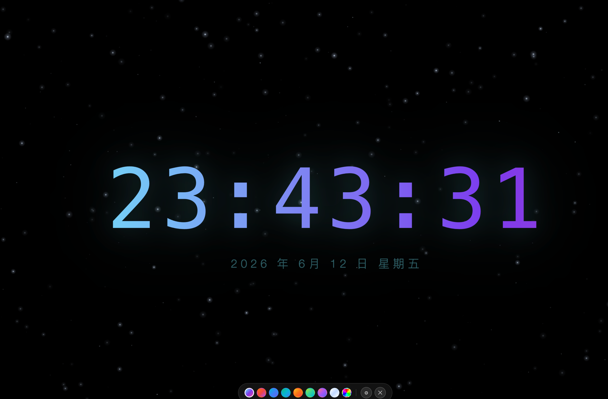

# 时钟屏保 · Clock Screensaver

A beautiful fullscreen clock screensaver for macOS, built with Electron.



## 功能特性

- **全屏时钟**：大号 `HH:MM:SS` 时间显示，带动态渐变文字效果。
- **日期显示**：显示年月日和星期。
- **多种文字颜色**：内置 8 套渐变色，也支持自定义纯色。
- **多种背景**：支持星空、纯黑、深海、暮色、网格和自定义图片背景。
- **自定义图片背景**：可以从本地选择图片作为屏保背景。
- **时区转换**：可以选择本机、北京、纽约、洛杉矶等时区，也支持输入 IANA 时区名称。
- **空闲自动显示**：可设置无操作后自动弹出，例如 5 秒、1 分钟、5 分钟、30 分钟等。
- **锁屏联动**：锁屏时显示，解锁时隐藏。
- **防烧屏漂移**：时钟内容会定时轻微移动，降低 OLED 烧屏风险。
- **配置持久化**：颜色、背景、空闲时间等设置会在重启后保留。
- **菜单栏运行**：应用常驻 macOS 菜单栏，不占用 Dock。
- **多屏支持**：连接多个显示器时，每个屏幕都会显示时钟窗口。

## 安装使用

### 下载已打包版本

1. 打开 [Releases](https://github.com/Masir1128/clock-screensave/releases)。
2. 下载最新版本的 `.dmg` 文件。
3. 打开 DMG，将 **时钟屏保** 拖到 **Applications / 应用程序** 文件夹。
4. 启动应用，菜单栏会出现 `⏰` 图标。

> 第一次启动时，macOS 可能提示应用来自未验证开发者。可以进入  
> **系统设置 → 隐私与安全性**，点击 **仍要打开 / Open Anyway**。

### 基本操作

| 操作 | 方法 |
|------|------|
| 显示 / 隐藏时钟 | 点击菜单栏 `⏰` 图标 |
| 快捷显示 / 隐藏 | 按 `Command + Shift + C` |
| 关闭当前时钟界面 | 按 `ESC`，或点击底部控制条的 `✕` |
| 切换文字渐变色 | 点击底部控制条里的圆形渐变色点 |
| 设置自定义文字颜色 | 点击底部彩虹色点，在颜色面板中选择色块、系统取色器或输入 HEX |
| 打开设置面板 | 点击底部控制条的齿轮按钮 |
| 切换背景 | 齿轮按钮 → **背景** → 选择星空、纯黑、深海、暮色、网格或图片 |
| 设置自定义图片背景 | 齿轮按钮 → **背景** → **图片...** → 选择本地图片 |
| 切换显示时区 | 齿轮按钮 → **时区** → 选择北京、纽约等时区 |
| 设置自定义时区 | 齿轮按钮 → **时区** → 输入 IANA 时区名，例如 `Asia/Shanghai` |
| 设置空闲自动显示时间 | 齿轮按钮 → **空闲多久后自动显示** |
| 右键菜单设置空闲时间 | 右键菜单栏 `⏰` → **无操作后自动显示** |
| 退出应用 | 右键菜单栏 `⏰` → **退出** |

### 作为屏保使用

macOS 不支持直接把普通 `.app` 设置成系统屏保 `.saver`。推荐使用下面的方式：

1. 将应用加入开机启动项：
   - 打开 **系统设置 → 通用 → 登录项**。
   - 点击 `+`，选择 `时钟屏保.app`。
2. 在应用内设置合适的空闲自动显示时间。
3. 可配合 **Lungo**、**Almighty** 等工具保持屏幕常亮。

这样应用会在空闲后自动显示，也会在锁屏时显示，效果接近屏保。

## 开发

### 环境要求

- macOS 12+
- Node.js 18+
- npm

### 本地运行

```bash
git clone git@github.com:Masir1128/clock-screensave.git
cd clock-screensave
npm install
npm start
```

运行后应用会出现在菜单栏中。

### 项目结构

```text
├── main.js          # Electron 主进程：窗口、菜单栏、空闲检测、锁屏事件、多屏支持
├── preload.js       # Context bridge：渲染进程和主进程之间的安全 IPC
├── index.html       # 渲染进程：时钟 UI、星空背景、颜色面板、背景设置
├── scripts/
│   └── gen-icon.js  # 生成 assets/icon.png
├── assets/
│   └── icon.png     # 应用图标
├── package.json     # 项目脚本和 electron-builder 打包配置
└── README.md
```

## 打包

### 1. 安装依赖

如果已经执行过 `npm install`，可以跳过这一步。

```bash
npm install
```

### 2. 本地测试

```bash
npm start
```

确认颜色、背景、自定义图片、空闲显示等功能正常后再打包。

### 3. 生成 DMG

```bash
npm run build
```

这个命令会先执行：

```bash
npm run gen-icon
```

然后使用 `electron-builder --mac` 生成 macOS 安装包。

打包完成后，输出文件会在 `dist/` 目录中，通常包括：

```text
dist/
├── mac-arm64/
├── mac/
└── 时钟屏保-1.0.0-universal.dmg
```

实际文件名会根据 `package.json` 中的 `version` 和 `productName` 变化。

## 常见问题

### 打包时提示权限或安全问题

当前配置会生成本地可用的 DMG，但没有做 Apple Developer ID 签名和 notarization。开源发布可以先使用未签名版本，但用户第一次打开时可能需要在 macOS 的 **隐私与安全性** 中手动允许。

### 自定义图片背景是否会复制到应用里？

不会。应用保存的是本地图片路径，并通过 `file://` 读取。请不要删除或移动原图片，否则下次启动可能无法显示该图片背景。

### 为什么不是系统设置里的真正屏保？

macOS 的系统屏保需要 `.saver` bundle。这个项目是普通 Electron `.app`，通过空闲自动显示和锁屏联动来实现类似屏保的体验。

## License

[MIT](LICENSE) © 科学羊
